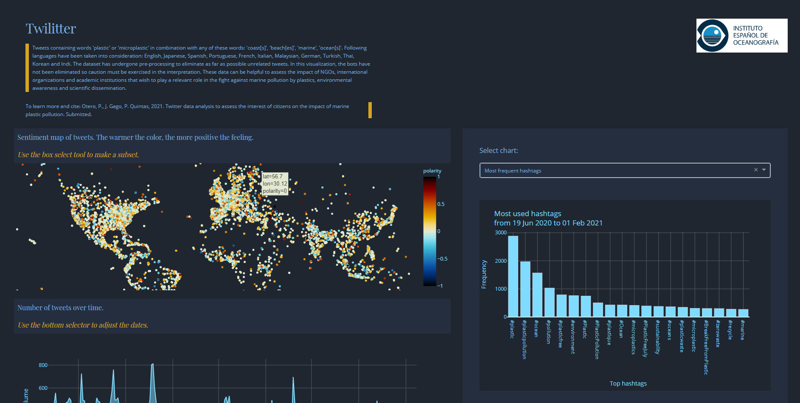

# Twilitter
## Python Dash app to visualize tweets about marine pollution by plastics 🥄🥛🌊

[Have a look to this app][app]

## Features

- Map of tweets with sentiment analysis
- Subset data by space and/or time
- Discover most used hashtags, counts with more engagement, top cities, nationalities, etc. 

## Preprocessing (...to create our csv file)

This Dash app loads data from a csv file. This file contains info related to tweets, which means that a preprocessing has been done. It is not the objective of this repository to show the applied preprocessing techniques. However, a summary would be:
- Tweets containing the word 'plastic' or 'microplastic' in combination with any of these words: 'coast[s]', 'sea', 'ocean[s]', 'beach', 'marine' have been previously retrieved using the Twitter API. As the free plan is being used, the Twitter database is scrapped every week. 
- The tweets have been obtained in a wide number of languages, which has required a prior translation of key words.
- In a second phase, tweets are filtered to discard those not directly related to marine pollution. For example, those tweets mentioning 'Plastic Beach', the third studio album by British virtual band [Gorillaz][wiki].
- Sentiment analysis is computed, coordinates obtained from user profile whenever possible by using OpenStreetMap, etc.
- Data are stored in csv files.

As the original files are very large, another csv file has been created containing the minimum information necessary for the Dash application. You can find an example in 'data' folder.

To learn more about the preprocessing:
_Otero, P., J. Gago, P. Quintas, 2021. Twitter data analysis to assess the interest of citizens on the  impact of marine plastic pollution. Submitted._

[//]: # (These are reference links used in the body of this note and get stripped out when the markdown processor does its job. There is no need to format nicely because it shouldn't be seen. Thanks SO - http://stackoverflow.com/questions/4823468/store-comments-in-markdown-syntax)

   [wiki]: <https://en.wikipedia.org/wiki/Plastic_Beach>
   [app]: <http://twilitter.herokuapp.com/>
